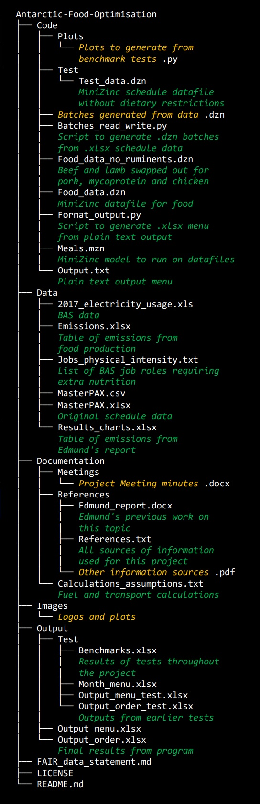

[](https://bas.ac.uk/ai)
[](https://ai4er-cdt.esc.cam.ac.uk/)
<br/><br/><br/>

# Antarctic-Food-Optimisation

<h1>Optimising remote field station food supplies for the British Antarctic Survey</h1>

Optimising logistics operations has a crucial impact on the overall carbon emissions entailed when 
planning a science campaign in Antarctica. One important problem is the planning of the food 
supply to feed a science team based at one of the remote Antarctic field stations over a season. 
The objective is to minimise waste, financial cost and the carbon 
emissions associated with the foods. This is done in the context of 
a variety of constraints. The daily menu meets nutritional requirements, is satisfying 
and enjoyable and satisfies individual dietary restrictions. These requirements are expressed as constraints with an objective 
to be optimised.  

The aim of this project is to construct a constraint program to solve this problem. The program 
scales to instances of about 160 people over 20 days, or 25 people over 4 months, and batches of data can be combined to allow planning for longer periods of time. The example provided in the program files is for 370 days of a real Rothera schedule. The food purchasing strategy is chosen according to availability of fresh foods brought by air.

Not all the necessary real data were available for this project so the implementation was based on some dummy data. Real data were used for Rothera personnel movements, Rothera schedule, emissions and aircraft fuel calulations. In the abscence of data specific to Rothera, dummy data were created, based on [other sources](https://github.com/Sophie-Turner/Antarctic-Food-Optimisation/blob/main/Documentation/References/References.txt), for meal arrangements, recipes, food costs, ship fuel calculations and people's dietary restrictions.

<h2>How to use</h2>
  
1. [Python](https://www.python.org/downloads/) and [MiniZinc](https://www.minizinc.org/) are required and are both open-source. 
Pandas, numpy and matplotlib were imported into the Python code and are also open-source. They can be installed using [Pip](https://pypi.org/project/pip/) by typing into the terminal:<br/>
```pip install pandas```<br/>
```pip install numpy```<br/>
```pip install matplotlib```<br/> <br/>
If you wish to use the existing data, skip step 2. If you wish to generate new batches:
2. Run the 'Batches_read_write.py' Python script on an up-to-date version of the 'MasterPAX.xlsx' spreadsheet. The script randomly generates fictional dietary restrictions for the group because these data were not provided. Update the script to include these if real data become available.
3. Run the 'Meals.mzn' model in MiniZinc with the Gecode solver, specifying 'Food_data.dzn' and a 'batchX.dzn' as MiniZinc datafiles. If you wish to see the effect on emissions of removing beef and lamb from the menu, select 'Food_data_no_ruminents.dzn' instead as the food data file.
4. Give MiniZinc 3 to 12 minutes to produce a satisfactory solution per batch. The output will be a menu, nutritional information and a shopping list to order with its costs.<br/><br/>
If you wish to save the menu and its nutritional information:
5. Save the menu output portion as plain text. If running multiple batches, one after the other, the output can all be placed in the same .txt file.
6. Run the 'Format_output.py' script on the text output. This will create a spreadsheet in the same directory.

<h2>File structure</h2>




